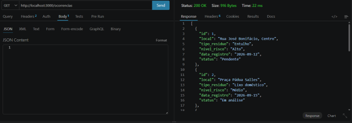
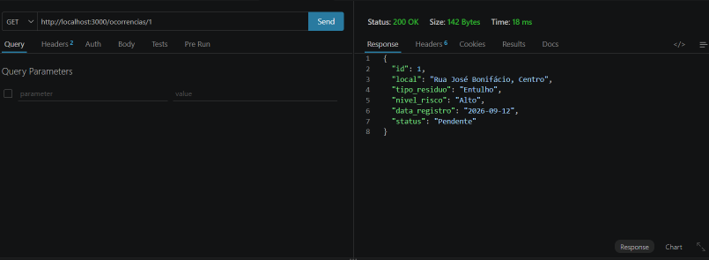
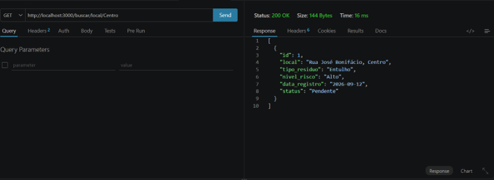
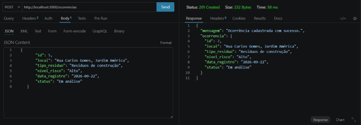
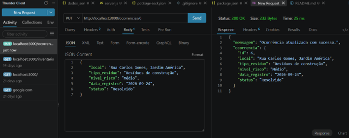
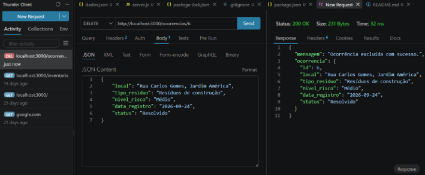
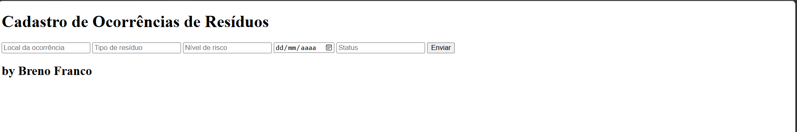
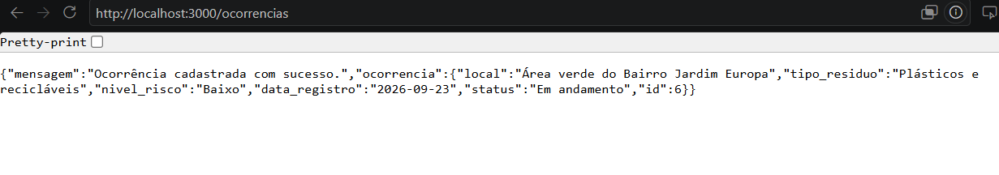

# Gestão de Resíduos Sólidos - Back-end
Exemplo simples de back-end com armazenamento em arquivo JSON para cadastro e monitoramento de ocorrências de descarte irregular de resíduos sólidos utilizando operações CRUD.

## Tecnologias 
- Node.js
- JavaScript
- VsCode
- VsCode Thunder Client

## Passos para testar 
- 1. Clone este repositório
- 2. Abra o projeto no VsCode e em um terminal digite: 
```
npm install
node server.js
```

- 3. Teste as rotas utilizando a extensão Thunder Client.

- 4. Abra o arquivo ```client/index.html```  utilizando o navegador ou a extensão Live Server.

## Print dos testes e exemplo de requisições


GET - TODAS AS OCORRÊNCIAS <br>


GET - BUSCAR POR ID <br>


GET - BUSCAR POR LOCAL <br>


GET - BUSCAR POR TIPO <br>


POST - CADASTRAR OCORRÊNCIA <br>


PUT - ATUALIZAR OCORRÊNCIA <br>


DELETE - EXCLUIR OCORRÊNCIA <br>


## Cliente 

Formulário <br>


Resposta do Formulário <br>

